Cyril 
SOUPRAMANIANE
M1DE
 

Projet DataViz
Cyril VIMARD

Table des matières

I.	Introduction	

II.	Méthodologie de collecte de données	

1.	Outils de scraping	

2.  Structure du projet 

3.	Analyse du site web	

III.	Nettoyage des données	

IV.	Visualisation	

I.	Introduction

Dans le cadre d’un projet d’exploitation, d’analyse, et de visualisations de données, j’ai réalisé ce rapport qui contiendra le processus complet d'extraction, de nettoyage et de transformation des données relatives aux Jeux Olympiques à partir de ce site web https://olympics-statistics.com/home. L’objectif du projet était d’employer un outil de scraping pour collecter des informations structurées et extraire des données contenues dans ce site web telles que : 
-	Les athlètes (nom, prénom, pays, genre) et leur palmarès
-	Les pays et leur nombre de médailles 
-	Les sports ainsi que les pays titrés dans ces sports et leur palmarès

II.	Méthodologie de collecte de données

1.	Outils de scraping

Pour ce projet, j’ai utilisé le langage de programmation principal qu’est Python qui m’a permis d’extraire des données qui ont été structurées dans un fichier JSON, accompagné de bibliothèques spécialisées.
Requests : Bibliothèque qui m’a permis d’effectuer des requêtes http vers le site web des JO pour récupérer les 3 données.
BeautifulSoup4 : Librairie qui m’a permis de naviguer dans le HTML et d’extraire les données à partir de la structure (code source) de la page
JSON : Librairie adaptée pour la manipulation des données JSON et la création de fichier JSON 

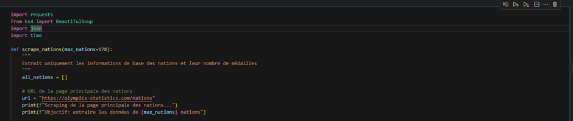

Il faut également installer les dépendances pour que le projet fonctionne. Voici la commande à lancer dans le terminal :

pip install pandas plotly requests beautifulsoup4

Pour voir les visualisations, il faut exécuter le fichier Visualisation.ipynb dans son intégralité. Les 3 visuels représentant les athlètes, les sports et les nations apparaitront. Il ne faut surtout pas exécuter le fichier scrapper.ipynb sous peine d'altérer les fichiers json et donc fausser les visuels.

2. Structure du projet

├── img/                          # Dossier pour les images si besoin
├── scrapper.ipynb               # Notebook d'analyse ou de collecte
├── visualisation.ipynb          # Notebook principal pour les visualisations
├── olympic_athletes.json        # Données sur les athlètes (nom, pays, genre, médailles)
├── olympic_nations_medals.json  # Données sur les nations (nom, total de médailles)
├── olympic_sports_medals.json   # Données par sport et pays (utilisé pour le Sunburst)
├── README.md                    # Documentation du projet
 
3.	Analyse du site web

Avant de commencer le scraping, j’ai analysé le code source de la page web avec les différentes classes qui contenaient les informations essentielles à la collecte de données. Elle permet de repérer les différentes difficultés que pourraient poser le site web lors du scraping comme les urls variant pour chaque athlète, les pages détaillant les résultats par discipline sportive et pays.
 
 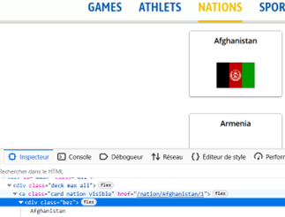

 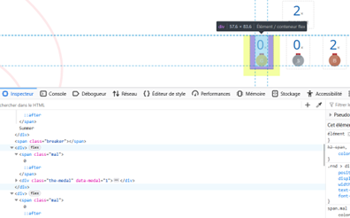
 
Dans ces deux captures d’écran, par exemple, la classe bez permet de récupérer le nom des pays pour le scraping des nations, et la classe mal permet de récupérer le nombre de médailles pour chaque catégorie (or, argent, bronze).

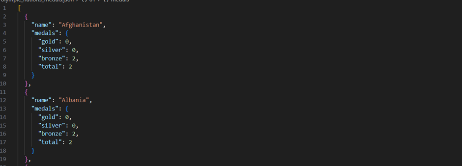
 
			Fichier JSON avec les nations et leur médailles

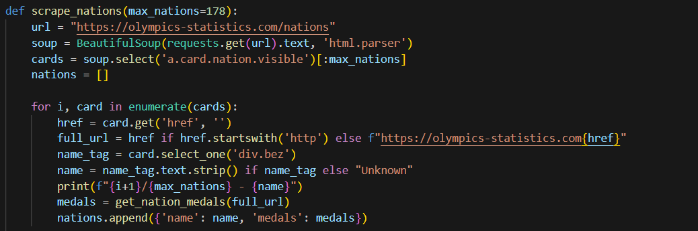 

Code de scrapping pour récupérer le pays avec la classe et le format du fichier JSON

III.	Nettoyage des données

Pour que le fichier JSON soit cohérent et que la visualisation représente correctement les données récupérées, il faut procéder à une étape de nettoyage qui permettra de garder que les données propres à l’emploi. 
Par exemple pour les athlètes, la récupération de leur nation a été fait par le biais du drapeau qui est représenté sur ces derniers. Or, l’image contient le nom du pays en abrégé. Il a donc fallu une standardisation des noms de pays pour récupérer le nom du pays des athlètes au complet.

 
Drapeau de l’athlète 
 
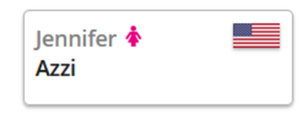 

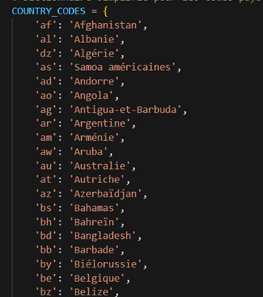
 
Standardisation des pays

Lors de la récupération du nom, prénom des athlètes représentés par les classes (nn, n), j’ai également supprimé les blancs avec la fonction strip.

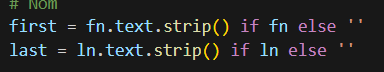
Suppression des espaces vides 

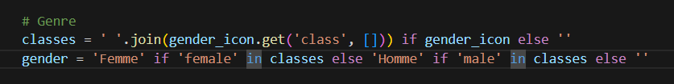

Normalisation des genres

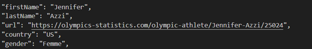 

Données nettoyées

Dans le cas des sports, j’ai récupéré l’ensemble des nations, et pas uniquement les top nations, puis je les ai ajouté dans le dictionnaire que si la nation contient des médailles et dans quel sport. Ce script permet ainsi de récupérer uniquement les informations essentielles sur les sports, réutilisables pour la visualisation.

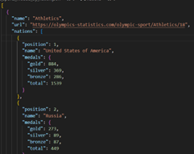 

A la fin du nettoyage des 3 bases de données, on a créée des fichiers JSON, qui nous ont permis de réaliser des visualisations dans le but de représenter les données scrappées et en faire une interprétation sur les Jeux Olympiques.

IV.	Visualisation

Pour interpréter et représenter les données contenues dans les fichiers JSON à propos des athlètes, j’ai utilisé la bibliothèque d3 en js qui m’a permis de représenter toutes les nations au sein d’une carte mondiale avec leur nombre de médailles par catégorie.

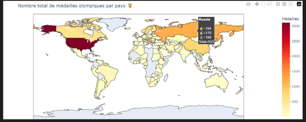
 

Dans le cadre des athlètes, j’ai décidé de les représenter sous forme d’histogrammes avec les 15 premiers athlètes masculins et 15 premiers féminins respectivement en Python, à l’aide de la bibliothèque pandas qui m’a permis de transformer mon fichier JSON en dataframe et plotly.express pour créer l’histogramme.

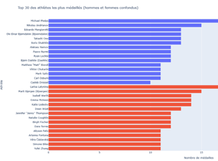

Enfin dans le cadre des sports, j'ai décidé de les présenter sous forme circulaire avec les 15 sports les plus médaillés au monde, ainsi que les 10 pays les plus médaillés dans ces derniers, en utilisant la librairie plotly.express et en important le graphique sunburst.

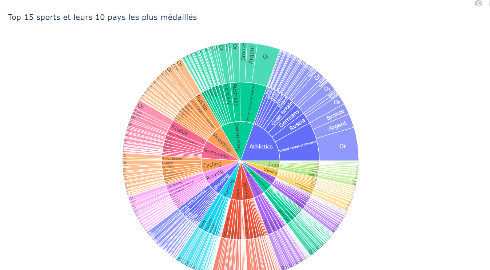

 
Le code ainsi que les visualisations sont disponibles dans le dépôt git ci-dessous : 
https://github.com/Saam03/DataVizAthlete
